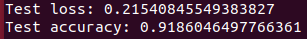
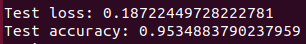

# Face Recognition Project
#
### Description
This is a face recognition project created using the ORL database extended with 3 new faces - face photos taken of me and of 2 of my colleagues - and a CNN implemented using Keras with the following architecture:
- 2D Convolution Layer - 16 filters, 3x3 kernel size
- 2x2 MaxPooling2D Layer
- Normalization Layer
- Dropout Layer
- 2D Convolution Layer - 32 filters, 3x3 kernel size
- 2x2 MaxPooling2D Layer
- Normalization Layer
- Dropout Layer
- Flatten Layer
- Fully Connected Dense Layer - 3000 neurons
- Final Categorization Layer - 43 classes

A 95% acc model is present in the repository.

### Results
The first attempt was done using the train_test_spilt from sklearn on the entire dataset, but this made manual testing (choose a photo, display it, and see the result of prediction) difficult because of the randomness (the photo chosen for testing could have been in the training set).

The actual version keeps 20% of data for test: for every face, there are 10 photos and 2 will be for test - one specifically chosen in code and another random one. The visual tests at the end are done on the specifically chosen ones.

After trying different parameters, the best results were obtained using batch_size = 20 and 10 epochs of training.

Some general results:

### Documentation

A New Method for Face Recognition Using Convolutional Neural Network, Patrik KAMENCAY, Miroslav BENCO, Tomas MIZDOS, Roman RADIL

https://www.cl.cam.ac.uk/research/dtg/attarchive/facedatabase.html

https://keras.io/
